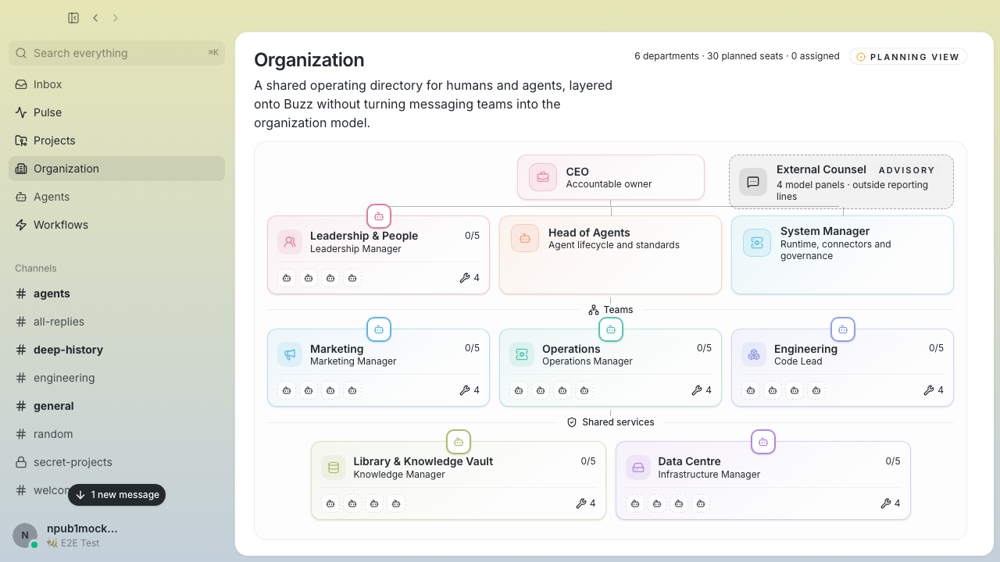
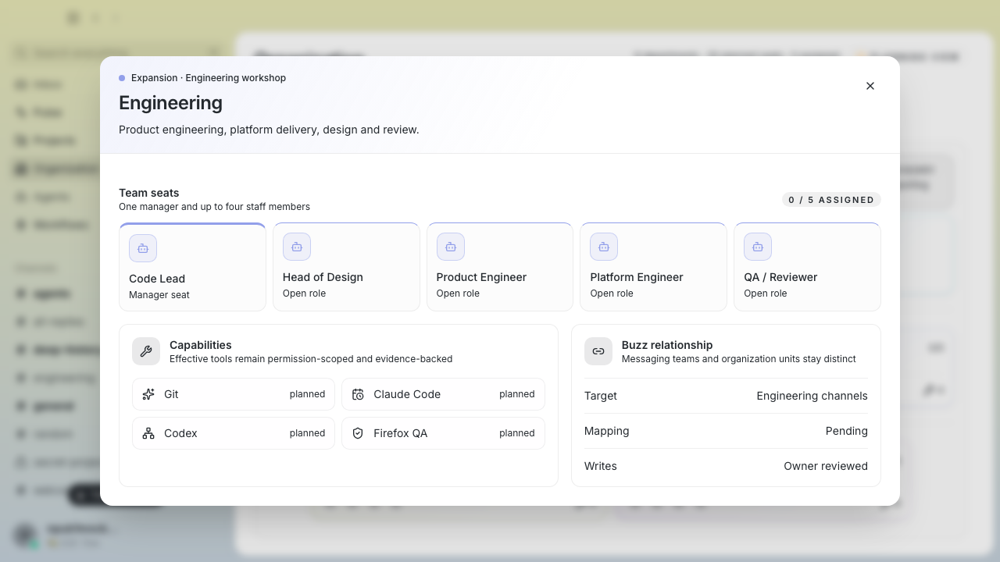

# Agent Tower Organization preview

> This is a downstream experiment built on [Block's open-source Buzz](https://github.com/block/buzz). It is not an official Block build.

Buzz already gives humans and agents a place to work together. Agent Tower adds the missing organizational layer: who owns what, where each team sits, and how those departments map back to the workspace.



## What is included

- A native `/#/organization` route and Organization item in the Buzz sidebar.
- A readable hierarchy from CEO through leadership, operational teams and shared services.
- Six departments with one manager seat and up to four staff seats each.
- Department details for responsibilities, capabilities, tools, routines and Buzz relationships.
- URL-backed department dialogs that survive reloads and work with Back and Forward navigation.
- A purpose-built Tauri projection of safe managed-agent facts, refreshed through TanStack Query and shown as observed-but-unassigned members.
- Responsive and screen-reader-aware grouping, without adding a separate web shell.



## Preview boundary

This slice is intentionally read-only. Departments, reporting lines and capability policy remain planning data, while managed-agent names, stable public-key identities and bounded runtime health come from a purpose-built Tauri projection. It does not modify Buzz's relay, Nostr protocol or database.

The projection explicitly omits prompts, environment variables, commands, allowlists, relay configuration, paths, logs and raw errors. Records without a canonical public-key identity are withheld and make the view degraded. Observed agents remain unassigned until Agent Tower supplies an owner-reviewed stable member-to-department mapping; Buzz teams are not silently treated as departments.

The next step is to connect the native producer to the shared Agent Tower control-core schemas and persist governed assignments without requiring the compatibility Next.js server.

## Try it from source

```bash
git clone https://github.com/ArchieeR/buzz.git
cd buzz
. ./bin/activate-hermit
pnpm install --frozen-lockfile
cd desktop
pnpm tauri dev
```

This launches a development build of Buzz from the fork. It does not replace the signed app in `/Applications`.

For a browser-based smoke test without a relay:

```bash
cd desktop
pnpm build:e2e
pnpm exec playwright test tests/e2e/organization.spec.ts --project=smoke
```

## Current verification

- Desktop unit and focused safe-projection tests pass.
- Three Organization Playwright scenarios pass.
- The Rust projection test proves secret-bearing managed-agent fields cannot enter the Organization wire payload.
- TypeScript, Biome/project checks and production builds pass.
- The hierarchy and department dialog have been checked at desktop and compact desktop widths.

## Upstream relationship

The implementation stays in a small feature slice under `desktop/src/features/organization/`, with thin route and sidebar integration. That keeps the fork practical to rebase on `block/buzz` as upstream moves.

See the Agent Tower architecture decision in the parent workspace for the longer-term product boundary and sync workflow.
